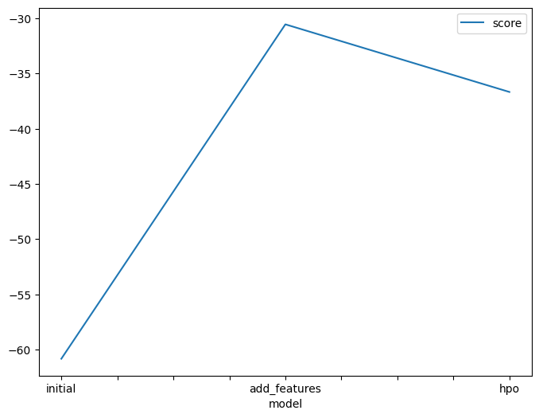
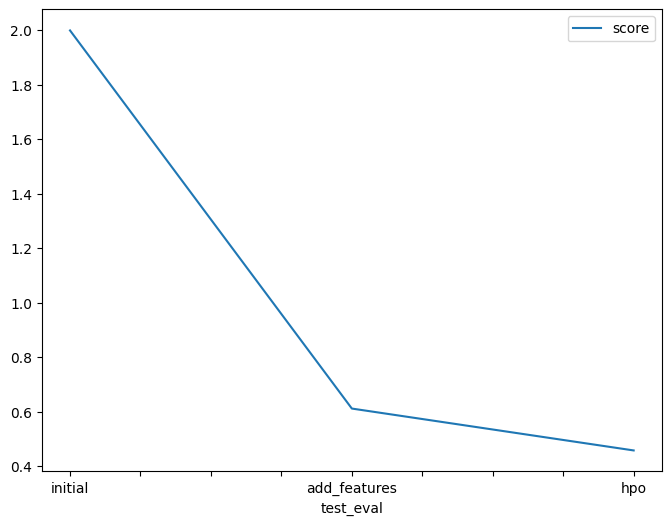

# Project_Predict_Bike_Sharing_Demand_with_AutoGluon


## Overview  
In this project, I used the AutoGluon library to build a regression model that predicts bike sharing demand based on temporal and weather data. The project involved exploratory data analysis, feature engineering, and hyperparameter tuning to improve model performance.

## Workflow  
- **Exploratory Data Analysis (EDA):** Examined the distribution of features and added new features extracted from the datetime column such as year, month, day, and hour. Converted some columns to categorical data types.  
- **Model Training:** Used AutoGluon to train a regression model and converted negative prediction values to zero to avoid submission rejection on Kaggle.  
- **Performance Improvement:** Tuned model hyperparameters like number of layers, dropout probability, and learning rate to enhance accuracy.

## Results  
| Stage                       | RMSE     |  
|----------------------------|----------|  
| Initial Training            | 1.99863  |  
| After Adding Features       | 0.61168  |  
| After Hyperparameter Tuning | 0.45804  |

## Plots  
  


## Files

- `Project_Predict_Bike_Sharing_Demand_with_AutoGluon.ipynb`  
  Notebook containing code only, without outputs. To see the results, download and run it on your device using Jupyter Notebook or Google Colab.

- `Project_Predict_Bike_Sharing_Demand_with_AutoGluon_completed.ipynb`  
  Notebook with code and outputs included. You can download and run it on your device to view the results directly.

- `Project_Predict_Bike_Sharing_Demand_with_AutoGluon.html`  
  HTML version of the notebook for viewing the code and outputs in a web browser.

- `report.pdf`  
  The final project report.

- Images folder  
  Contains all images used in the project.


## Dataset  
Training and test datasets are not included due to size. They can be downloaded from the [Kaggle Bike Sharing Demand competition page](https://www.kaggle.com/c/bike-sharing-demand/data).

## Requirements  

To run this project locally, you'll need to install the following Python packages. These steps ensure compatibility with AutoGluon and its dependencies:

```bash
pip install -U pip
pip install -U setuptools wheel
pip install -U "mxnet<2.0.0" bokeh==2.0.1
pip install autogluon --no-cache-dir
pip install kaggle pandas matplotlib
